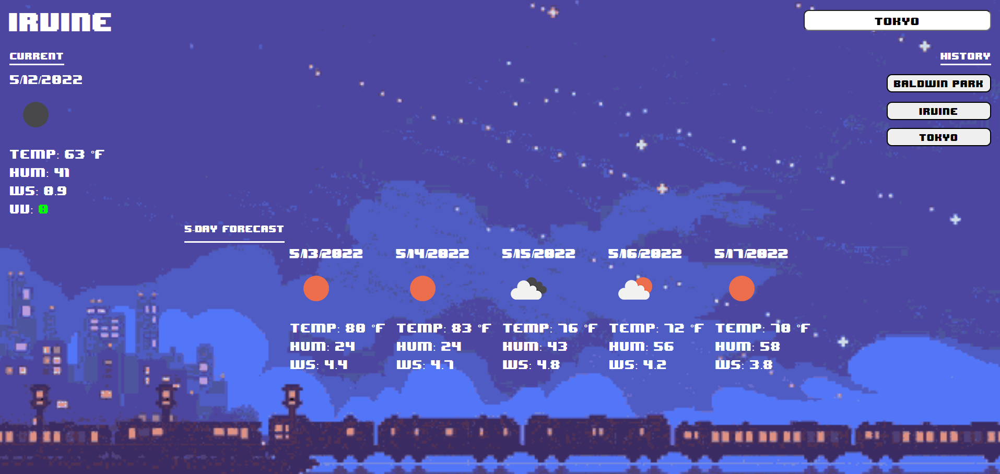

# 06-Server-Side-APIs-Homework: Weather Dashboard

Create a weather dashboard using one server side API. 
Dashboard will allow the user to search a city, and have it's weather displayed.

# Site Preview

    

# Github Links
- Repository: https://github.com/brianalegre/06-Server-Side-APIs-Homework
- Deployed: https://brianalegre.github.io/06-Server-Side-APIs-Homework/

# Criteria 
- Use an API to get the weather
- Use localstorage
- Form inputs
- Current and future conidtions for that city
 - City is added to search history

- Display: 
 - City Name, 
 - Date, 
 - Weather Icon, 
 - Temperatuure, 
 - Humidity, 
 - Wind Speed, 
 - Index

- Color Code for UX Index: 
 - Favorable
 - Moderate 
 - Severe

- Future weather condidtions
 - 5-day forecast
    - Date, 
    - Weather Icon, 
    - Temperatuure, 
    - Humidity, 
    - Wind Speed

- Able to click History
 - Display Current, and future conditions

# Notes and Articles
Open Weather API
- https://openweathermap.org/api/one-call-api

Open Weather API Documentation
- https://openweathermap.org/api

Open Weather FAQ
- https://openweathermap.org/faq

Open Weathen One Call API
- https://openweathermap.org/api/one-call-api

API Call 
- http://api.openweathermap.org/data/2.5/forecast?id=524901&appid={API key}

Example of API Call
- api.openweathermap.org/data/2.5/forecast?id=524901&appid={API key}

GeoCoding API 
- https://openweathermap.org/api/geocoding-api

Convert UNIX UTC 
- https://coderrocketfuel.com/article/convert-a-unix-timestamp-to-a-date-in-vanilla-javascript

One Call How to make an API call
- https://api.openweathermap.org/data/2.5/onecall?lat={lat}&lon={lon}&exclude={part}&appid={API key}

Geocoding API Call
- http://api.openweathermap.org/geo/1.0/direct?q={city name},{state code},{country code}&limit={limit}&appid={API key}
